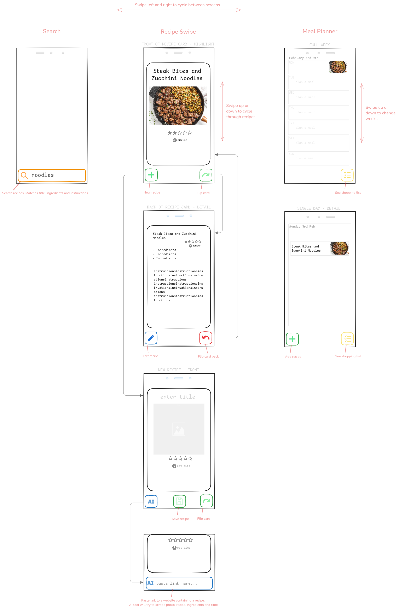

Here is the wireframe mapping out most of the app's pages. As you can see I have designed for mobile first, and then if we want to we can adapt for bigger screens.

There are three main sections, which the user gets to by swiping left or right. Still need to add detail to **search** and **meal planner** screens, and add a **shopping list** page to **meal planner**.

Even though this is just the way things look by default in the drawing tool I used (Excalidraw), I quite like this 'sketchy' style.

See also: Neubrutalism https://dribbble.com/search/neubrutalism

Perhaps this could be an early task: start to create the app's component library:

-   Button - should be able to pass in a colour and an icon
-   ExpandableButton - a version of the button which expands to include a text input (see AI button / search bar)
-   StarRating
-   CookingTimeBadge

Then the slightly larger components which are more like views:

-   Card:
    -   Should have a front and a back
    -   Should have slots for the title, image, widgets, text inputs, etc
    -   Perhaps a flip animation? Dunno how hard that'd be
-   PlannerDay:
    -   Represents a day in the planner
    -   Shows thumbnails in the full week view
    -   Expands on click to show detail
